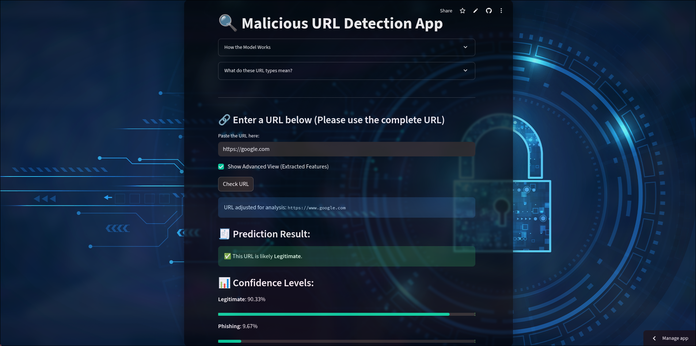

# 🔐 Malicious URL Detection Web App

This project is a machine learning-powered web application built with **Streamlit** that detects whether a URL is:

- ✅ Benign  
- ❗ Malware  
- ⚠️ Phishing  
- 🚫 Defacement

It extracts URL features automatically and uses a trained Random Forest Classifier to predict the type with a confidence percentage.

---

## 🚀 Live Demo

👉 [malicious-url-detection-3hxevj9a98knnaqyejlfha.streamlit.app](https://malicious-url-detection-3hxevj9a98knnaqyejlfha.streamlit.app/)

---

## 🖼 Screenshot

```

```

---

## 🛠 Features

- Paste a raw URL — the app extracts all features automatically
- Predicts whether the URL is safe or malicious
- Shows class probabilities with bar chart
- Advanced view for raw features
- Responsive dark theme + background image

---

## 📦 Tech Stack

- Python
- scikit-learn
- pandas, numpy
- tldextract, ipaddress
- Streamlit

---

## 📂 Project Structure

```
malicious-url-detector/
├── app.py
├── malicious_url_model.pkl
├── requirements.txt
├── .streamlit/
│   └── config.toml
└── README.md
```

---

## 🧪 Run Locally

```bash
git clone https://github.com/your-username/malicious-url-detector.git
cd malicious-url-detector
pip install -r requirements.txt
streamlit run app.py
```

---

## 👤 Author

**Keshav Singh**  
[GitHub](https://github.com/Kesin2540/)
[LinkedIn](https://linkedin.com/in/keshav-singh-1955b2317)

